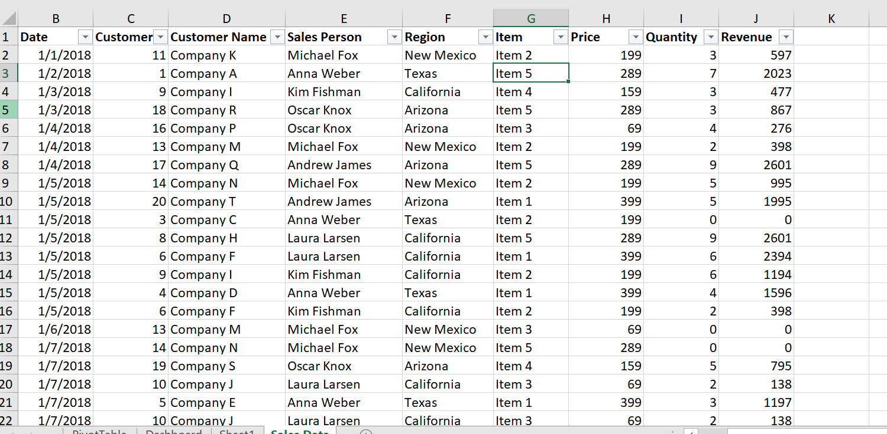
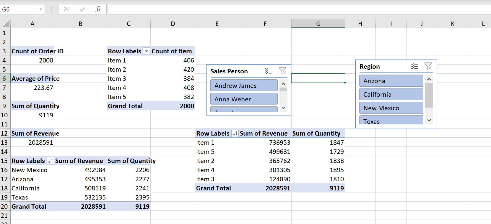
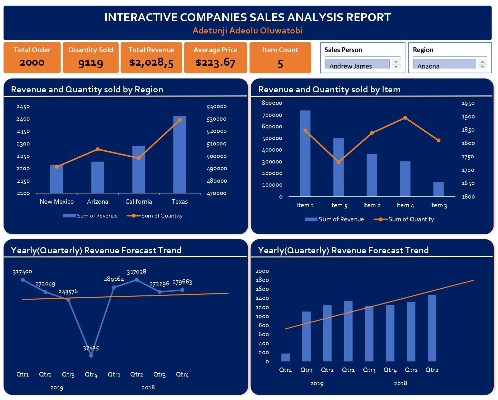

## Interactive-Sales-Dashboard

### Introduction
An analysis of sales performance in four regions of operations. This analysis also explored historical data and predictions of future sales for the business.

## Technical Skills Demonstrated
In this analysis, I demonstrated my core skills in performing data cleaning and analysis with Microsoft Excel. Also, putting into good use my analytical and critical thinking skills to better understand the business model and its activities. 

## Problem Statements
The following were the problem statements from the data:
- What is the performance of the 4 regions in terms of revenue generation?
- What is the performance in terms of the quantity of items sold across each region?
- The sales representatives across each region measurements based on revenue generated and quantity sold
- What are the yearly and quarterly forecasts and predictions of sales in quantity and revenue?

## Data Preparation/Modelling
Because this is a Microsoft Excel project, the raw data was cleaned, transformed, and manipulated using Microsoft Excel only. After this, Pivot tables were created and from these activities, analysis findings were been discovered from the exploratory data analysis.

## Analysis Result/Findings

The following findings were the result of the analysis which will help the business make some new business decisions and position itself for more profit-making in the 4 regions analyzed.

- The total revenue across the 4 regions analyzed grossed a little over $USD2000 with over 9000 quantities of orders sold in about 2000 total order fulfillment.
- The city of Texas recorded the highest revenue and quantity sold while New Mexico recorded the least in terms of revenue generation and quantity sold.
- Item 1 in the product catalog recorded the highest quantity sold of over (1,900) across all 4 regions, however, item 4 recorded the highest revenue ($600+) even though it has a lesser quantity of items sold (1700).
- The yearly (quarterly) forecast shows there will be a stable trend of revenue from quarter 4 of 2019 while the number of items sold will see a steady upward rise from the same quarter 4 of the same year 2019

## Recommendations
- Focus on Profitability: While the number of items sold is increasing, it might be more beneficial to prioritize high-margin items like Item 4.
- Invest in Regional Marketing: Consider allocating more resources to marketing and sales efforts in underperforming regions like New Mexico.
- Develop Targeted Promotions: Create targeted promotions or discounts for specific items or regions based on sales data and customer preferences.
- Upselling and Cross-selling: Train sales staff on upselling and cross-selling techniques, particularly focusing on promoting high-margin items (like Item 4) to customers who purchase high-volume items (like Item 1).
- Customer Segmentation and Targeting: Analyze customer data to segment your customer base and tailor marketing campaigns or promotions to their specific needs and preferences.

## Conclusion
With the above analysis findings and recommendations, I believe the business will be better positioned going forward in areas such as customer segmentation, marketing, promotions, product development, and staff upscaling.
